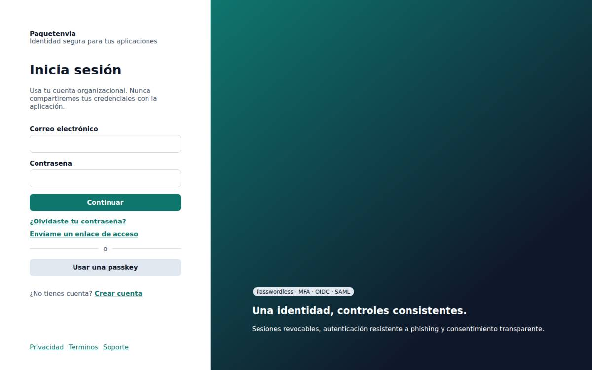
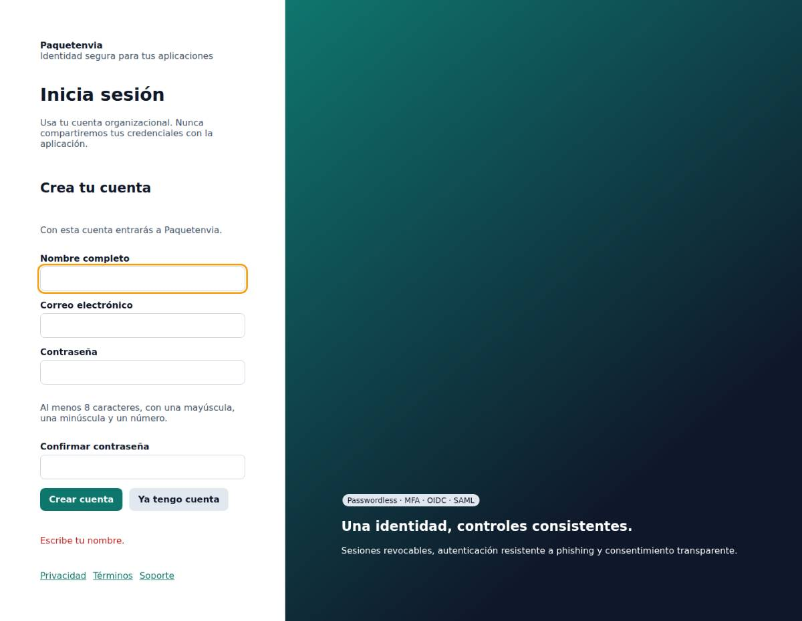
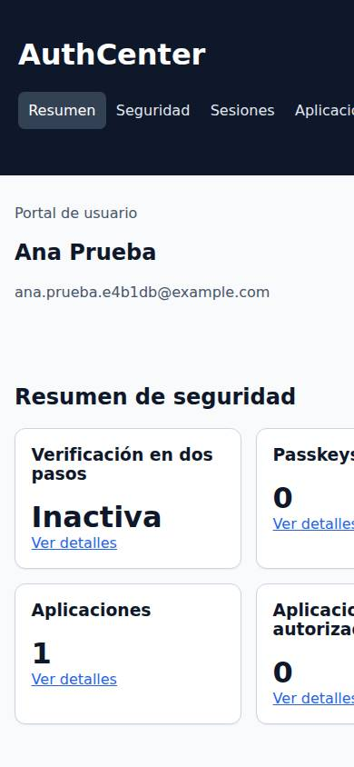
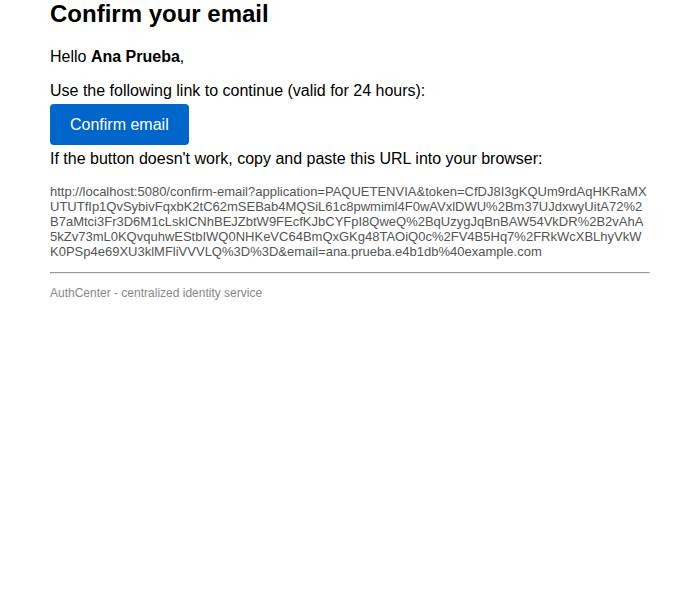
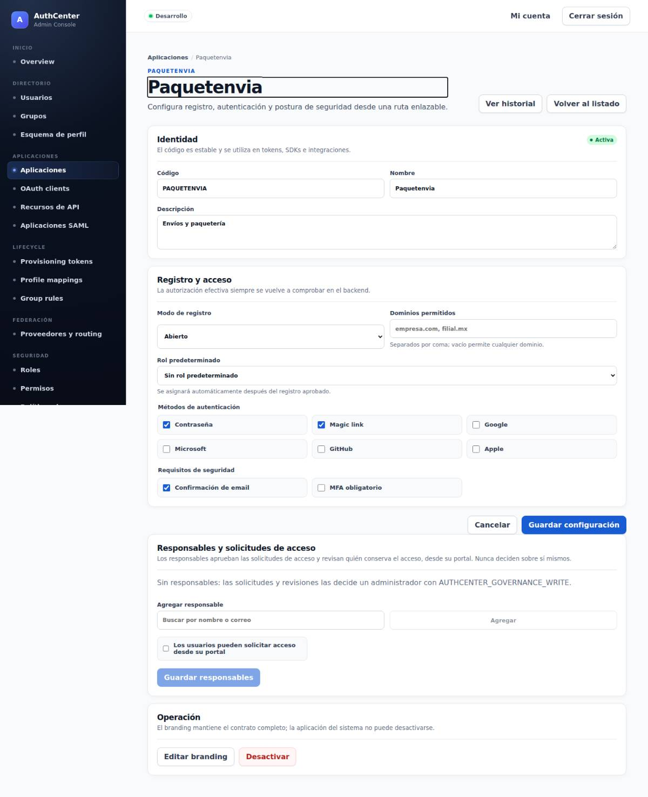
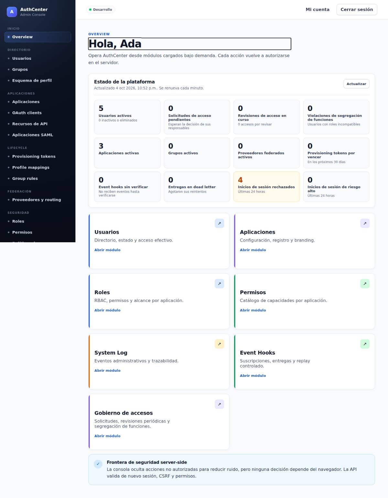
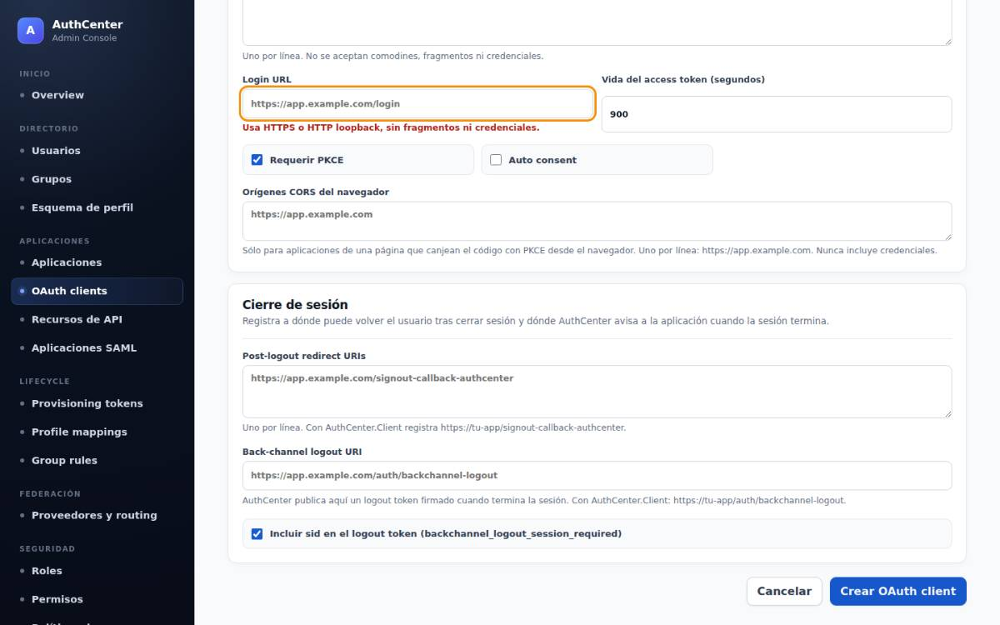

# Análisis de arquitectura, producto y UX

Fecha: 2026-10-04 · Base: `main` @ `0320243` · Enfoque: experiencia de usuario primero.

**Método.**
- Levanté AuthCenter en local (Release, SQL Server 2022) con dos aplicaciones de demostración: *Paquetenvia*, con marca, registro abierto y confirmación de correo, y *Portal de Finanzas*, con MFA obligatorio.
- Capturé 65 pantallas reales en escritorio (1440 px) y móvil (390 px): login, registro, MFA, consentimiento, portal, correos y consola.
- En paralelo se hicieron tres auditorías de código con evidencia `archivo:línea`. Están en los anexos y verifiqué en el código las afirmaciones más relevantes:
  - [A — Usuario final](auditorias/A-usuario-final.md): 26 hallazgos `UX-nn`.
  - [B — Consola](auditorias/B-consola.md): 32 hallazgos `ADM-UX-nn`.
  - [C — Arquitectura, desarrollador y operación](auditorias/C-arquitectura-dx.md): 34 hallazgos (`ARQ-nn`, `DX-nn` y `OPS-UX-nn`).

## 1. Veredicto

AuthCenter es técnicamente serio y su seguridad es estricta por diseño:
- OIDC con PKCE obligatorio, SAML, SCIM, políticas versionadas con simulación, gobierno de accesos y passkeys.
- Step-up de un solo uso, secretos que se muestran una vez, CSP estricta y pruebas e2e con axe.

**El problema no es lo que hace, sino cómo se siente usarlo.** El producto le habla en lenguaje de protocolo a personas que no lo hablan:

1. **El usuario final de Paquetenvia no ve Paquetenvia.**
   - Ve un login con marketing técnico ("Passwordless · MFA · OIDC · SAML") y el lema de AuthCenter.
   - Le piden una "cuenta organizacional" en una app de consumo.
   - Recibe correos en inglés firmados por "AuthCenter".
   - Si algo falla, el error aparece al pie del formulario, lejos del campo, y a veces sin salida.
2. **El administrador navega por entidades técnicas, no por tareas.**
   - Hay 20 entradas de menú, 8 en inglés.
   - La configuración de una aplicación está repartida en 6 lugares.
   - Hay un error crítico: si escribe mal su contraseña al confirmar una acción sensible, la consola lo expulsa y pierde lo escrito.
3. **Conectar una app exige saber OAuth de memoria.**
   - Son ≥5 pantallas y ≥30 campos.
   - Hay un campo obligatorio ("Login URL") cuyo valor correcto sólo dice la documentación.
   - Los SDK no están publicados y el entorno local no funciona con ellos tal como viene.
4. **Operar es editar variables y reiniciar.** SMTP, llaves, dominio y primer administrador no están en la consola; el correo se configura a ciegas.
5. **La arquitectura frena los cambios de UX.**
   - No hay capa de textos ni de idiomas.
   - La política de contraseñas está en 9 lugares y ya diverge: 8 caracteres en el servidor, 12 en la consola.
   - Servicios de 1.300 a 1.700 líneas.
   - Dos sistemas de diseño que no comparten nada.

La buena noticia: casi todo se corrige sin tocar el núcleo de seguridad. La [hoja de ruta](#9-hoja-de-ruta) empieza por arreglos de días que eliminan los peores tropiezos.

## 2. Evaluación por dimensión

| Dimensión | Nota (1–5) | Por qué |
|---|---|---|
| Seguridad y estándares | **4,5** | PKCE obligatorio, step-up de un solo uso, secretos de un solo uso, CSP estricta, auditoría y concurrencia optimista. |
| Amplitud funcional | **4** | OIDC, SAML IdP/SP, SCIM, gobierno y federación. Faltan login social hospedado, política de contraseñas configurable e idiomas. |
| Arquitectura y mantenibilidad | **2,5** | Servicios "dios", contrato `ApiResponse<object>` sin tipos (302 usos), reglas duplicadas, sin capa de textos y cachés locales por instancia. |
| Experiencia del usuario final | **2** | Voz de empresa en apps de consumo, errores lejos del campo, callejones sin salida, correos en inglés sin marca y portal roto en móvil. |
| Experiencia del administrador | **2,5** | Buena base (filtros en la URL, step-up, simuladores, webhooks), pero la navegación va por entidades, hay jerga, el primer uso no tiene guía y existe un error crítico de reautenticación. |
| Experiencia del desarrollador | **1,5** | SDK sin publicar, entorno local incompatible con sus propios SDK, errores en JSON crudo y la trampa de "Login URL". |
| Operación | **2** | Todo por variables y scripts, SMTP sin prueba y sin vista del estado del sistema. |
| Accesibilidad | **3** | Axe en CI, diálogos nativos y foco gestionado. Pero el anillo de foco y los bordes quedan bajo 3:1, el portal no se adapta a 320 px y los errores no van asociados al campo. |
| Consistencia visual e idioma | **1,5** | Dos sistemas de tokens y tres azules distintos; mezcla de español e inglés en UI, API y correos. |

**Conservar:**
- El step-up con prueba de un solo uso y los secretos que se muestran una vez.
- Los simuladores: políticas, routing de federación y mapeos.
- El flujo de webhooks: verificación, snippet de firma y replay.
- Los filtros y la paginación en la URL.
- La importación de metadatos SAML y "Probar conexión".
- La idempotencia, la concurrencia por versión y las pruebas axe con reflow en la consola.

## 3. Para quién es AuthCenter

| Persona | Trabajo principal | Fricción hoy | Experiencia objetivo |
|---|---|---|---|
| **Usuario final** (p. ej. de Paquetenvia) | Entrar o crear su cuenta sin pensar | Marca ajena, "cuenta organizacional", errores al pie, correos en inglés, callejones | Login con la marca de la app, 1 título y 1 acción por paso, errores junto al campo, siempre con salida |
| **Administrador / mesa de ayuda** | Dar acceso y resolver "no puedo entrar" | Menú por entidades; System Log con códigos crudos y UUID, sin motivo del fallo | Ficha de la persona con acceso efectivo e historial de inicios de sesión legible; diagnóstico en < 2 min |
| **Responsable de app / desarrollador** | Conectar su app y ver un login funcionando | ≥5 pantallas, ≥30 campos, "Login URL" trampa, SDK sin publicar, entorno local roto | Asistente de 3–4 pasos con credenciales, snippet y "Probar inicio de sesión"; primera integración en < 30 min |
| **Seguridad / cumplimiento** | Saber quién tiene acceso y por qué | Eventos con códigos crudos y fechas en UTC sin zona | Conservar gobierno y simulación; humanizar eventos y fechas |
| **Dueño de la plataforma** | Operar sin tocar variables | SMTP, llaves, dominio y primer admin por variables y reinicios | "Configuración" en la consola, con pruebas y estado del sistema |

## 4. Principios de diseño

1. **La marca es de la aplicación.** El usuario ve Paquetenvia, en login, portal, correos y errores. AuthCenter sólo aparece si aporta confianza (pie opcional "Protegido por AuthCenter").
2. **Habla como la persona, no como el protocolo.** El término de la tarea va primero y el técnico como apoyo: "URLs de regreso (redirect_uri)".
3. **Un paso, un título, una acción principal.** Cada vista tiene su propio encabezado y su `document.title`.
4. **Errores junto al problema, y siempre con salida.** Qué pasó, qué hacer y un botón para hacerlo.
5. **Seguro por defecto, avanzado plegado.** Presets por tipo de app; lo poco común va bajo "Opciones avanzadas".
6. **Todo lo de una aplicación, en un lugar.** Un hub por aplicación, no seis módulos.
7. **Móvil y accesible desde el diseño.**
   - Reflow a 320 px sin desplazamiento horizontal.
   - Contraste ≥ 4,5:1 en texto y ≥ 3:1 en foco y bordes.
   - Objetivos táctiles de 44 px.
8. **Un solo sistema.** Los mismos tokens, componentes, mensajes e idioma en login, portal, correos y consola.

## 5. Hallazgos principales

Severidad: **crítica** bloquea o pierde datos; **alta** rompe un trabajo clave; **media** es fricción frecuente. Los IDs remiten a los anexos.

### 5.1 Usuario final



| # | Hallazgo | Sev. | Evidencia |
|---|---|---|---|
| 1 | **El login de una app no habla como la app.** Bajo el nombre aparece el lema de AuthCenter, el subtítulo pide "cuenta organizacional" y un panel con "Passwordless · MFA · OIDC · SAML" ocupa el 64 % de la pantalla. El color de fondo de marca nunca se ve. | Alta | UX-18, UX-01 · `login.html:20,25,125-127` · captura 01 |
| 2 | **"Inicia sesión" en todas las vistas.** El H1 y el subtítulo son fijos: en crear cuenta, revisar correo, MFA, códigos de respaldo y consentimiento compiten dos títulos. | Alta | UX-01 · `login.js:80-85` |
| 3 | **Errores al pie, lejos del campo.** Una sola línea `#status` para todo; ningún `aria-invalid`. En móvil, con el teclado abierto, el error queda fuera de la vista. | Alta | UX-02 · captura 03 |
| 4 | **Texto en inglés o "Request failed (401)"** cuando un código no está en el mapa de la página. Son tres diccionarios duplicados con textos distintos para el mismo código. | Alta | UX-03, UX-14 · `shared.js:20`, `login.js:230` |
| 5 | **Callejones sin salida.**<br>– Correo sin confirmar: no hay botón para reenviar la confirmación.<br>– Solicitud caducada: sólo queda un texto rojo, sin acción.<br>– `/logout` abierto directamente: pregunta "¿Quieres cerrar sesión?" sin botones y, a la vez, dice que la solicitud expiró.<br>– Enlace caducado o fallo de red: se presenta como enlace inválido.<br>– MFA perdido: no hay ruta de recuperación ni aviso de intentos restantes. | Alta | UX-09…12 |
| 6 | **Correos en inglés, sin la marca de la app y con vigencias falsas.** El asunto es "Confirm email - AuthCenter" y no nombra a Paquetenvia. El enlace mágico dice "valid for 24 hours" pero vence a los 15 minutos. Sólo HTML, sin parte de texto plano. | Alta | UX-24 · `SmtpEmailService.cs:34,184` · captura 06 |
| 7 | **Consentimiento con scopes crudos** ("openid", "profile", "email"). No muestra con qué cuenta se entra ni ofrece "¿No eres tú?". | Alta | UX-22 · captura 04 |
| 8 | **El portal no se adapta al móvil.** En 390 px la página mide 814 px: la barra de 7 secciones no se ajusta. Siempre dice "AuthCenter". | Alta | UX-17, UX-18 · `app.css:99-102` · captura 05 |
| 9 | **El portal sólo se abre directamente para quien tiene acceso a la app `AUTHCENTER`** (por código). Afecta a los enlaces "Open your account" de los correos. | Alta | UX-13 · `shared.js:46-47` |
| 10 | **No hay login social en el login hospedado.** La consola ofrece interruptores de Google, Microsoft, GitHub y Apple que el flujo estándar no usa. | Alta (B2C) | DX-08 · `docs/google-sign-in.md:5` |
| 11 | **Sin estados ocupados.** Los botones no se deshabilitan; un doble clic en el restablecimiento de contraseña convierte el éxito en "el enlace no es válido" (por código). | Media | UX-06 |
| 12 | **El anillo de foco (2,15:1) y los bordes de los campos (1,48:1) quedan por debajo de 3:1**; los enlaces que actúan como botón miden unos 19 px de alto. | Media | UX-16 |

<p>



</p>

### 5.2 Consola de administración



| # | Hallazgo | Sev. | Evidencia |
|---|---|---|---|
| 13 | **Una contraseña mal escrita en la reautenticación expulsa al operador al login.** El endpoint responde 401 y la consola redirige ante cualquier 401. En federación se pierde el formulario, con el secreto del IdP incluido. | **Crítica** | ADM-UX-05 · `ReauthenticationController.cs:39`, `api/client.ts:56` |
| 14 | **Navegación por entidades técnicas:** 8 grupos y 20 entradas. 8 etiquetas están en inglés: Overview, OAuth clients, Lifecycle, Provisioning tokens, Profile mappings, Group rules, Event Hooks y System Log. | Alta | ADM-UX-01, ADM-UX-27 · `AppShell.tsx:19-70` |
| 15 | **Textos escritos desde la implementación:** "módulos cargados bajo demanda", "rutas que puedes compartir", "La autorización efectiva siempre se vuelve a comprobar en el backend", "Frontera de seguridad server-side". Además, códigos de permiso crudos como `AUTHCENTER_GOVERNANCE_WRITE` en 18 mensajes. | Alta | ADM-UX-02, ADM-UX-03 · captura 07 |
| 16 | **La aplicación está repartida en 6 lugares** (aplicación, clientes OAuth, apps SAML, políticas, federación y diálogo de marca). Su ficha no lista clientes, usuarios ni política vigente. | Alta | ADM-UX-06 · captura 08 |
| 17 | **Alta de cliente OAuth:** 16 grupos de controles de protocolo (≥21 entradas) sin presets y Client ID tecleado a mano. "Login URL" es obligatorio, sugiere la URL de la app (incorrecta) y, vacío, falla con un mensaje de formato en vez de "obligatorio". Los scopes por defecto de la consola no incluyen `offline_access`, que el BFF pide: el primer login falla con `invalid_scope`. | Alta | ADM-UX-07 · `oauth-client.ts:44`, DX-02 · capturas 09, 10 |
| 18 | **El System Log no permite diagnosticar "no puedo entrar".** Los filtros son de texto libre para valores enumerables, el actor se busca por UUID y no hay columna de motivo (sólo aparece en el JSON del detalle). `/oauth/authorize` no audita sus errores. | Alta | ADM-UX-24 · captura 11 |
| 19 | **Primer uso sin guía.** El admin aterriza en el portal de usuario final. El dashboard muestra 12 métricas con el mismo peso, 7 tarjetas que repiten el menú y una nota técnica. Las aplicaciones no tienen estado vacío. | Alta | ADM-UX-20, ADM-UX-21 |
| 20 | **Errores del servidor en inglés pegados a frases en español:** "Revisa los datos del formulario. LoginUrl must be an absolute HTTPS URI…". | Alta | ADM-UX-04 · `errors.ts:34` |
| 21 | **Formularios incoherentes.**<br>– Varios "Guardar" por página: 3 en la ficha de usuario.<br>– Sin marcas de obligatorio y validación sólo al enviar.<br>– Sin protección de cambios sin guardar.<br>– 13 copias locales de `Field`.<br>– 5 textos distintos para el mismo conflicto de concurrencia. | Media | ADM-UX-10…13 |
| 22 | **Valores por defecto que dejan la configuración inútil sin avisar.**<br>– La app nace "Cerrada", sin ningún siguiente paso.<br>– En federación, JIT y vinculación vienen apagados.<br>– La primera regla activa de una política convierte "permitir todo" en "denegar el resto". | Media | ADM-UX-08 |
| 23 | **Un contorno negro grueso rodea cada H1**: foco programático sin estilo. Todas las pestañas tienen el mismo título. | Media | ADM-UX-28 · captura 07 |
| 24 | **No existe pantalla para la política de contraseñas ni para el bloqueo de cuentas** (están fijos en el código). El MFA sólo se configura app por app. | Media | ADM-UX-09 |

<p>


</p>

### 5.3 Desarrollador y operación

| # | Hallazgo | Sev. | Evidencia |
|---|---|---|---|
| 25 | **Los SDK de las guías no se pueden instalar**: no están publicados (OPS-14). | Crítica | DX-01 |
| 26 | **Un AuthCenter local no funciona con sus propios SDK.** El issuer de Development es `"AuthCenter"` (no es una URL), el origen público usa un puerto que ningún perfil levanta y los SDK exigen HTTPS. Los correos locales no se entregan. El quick start tiene ≥4 pasos bloqueantes sin documentar. | Crítica | DX-02, DX-03 · `appsettings.Development.json:9,77` |
| 27 | **Errores de configuración en JSON crudo en el navegador**: `redirect_uri` no registrado o `client_id` desconocido. El scope rechazado no se nombra. | Alta | DX-05, UX-25 |
| 28 | **El correo se configura a ciegas.** No hay prueba ni vista del outbox, y el arranque no valida `Email:Host`. Sin SMTP, el outbox reintenta para siempre mientras el usuario lee "Te enviamos un código". | Alta | OPS-UX-01 |
| 29 | **Llaves, dominio y primer administrador se gestionan por variables:** rotar la llave de firma son 3 despliegues. Para dar de alta una app hizo falta un script de 407 líneas. | Alta | OPS-UX-02…06 |
| 30 | **El README tiene 1.043 líneas** y mezcla quick start, configuración y API (documenta 114 de 286 endpoints). Los documentos alternan inglés y español. | Media | DX-09 |

### 5.4 Arquitectura (lo que hace lenta la UX)

| # | Hallazgo | Sev. | Evidencia |
|---|---|---|---|
| 31 | **Sin capa de localización ni catálogo de errores.** Hay 255 códigos sueltos. Las UIs tienen el español en el código; la API y los correos están en inglés. `ui_locales` se lee pero no se usa. | Alta | ARQ-04, ARQ-05 |
| 32 | **Reglas duplicadas que ya divergen.**<br>– Política de contraseñas en 9 lugares: 8 caracteres en el servidor, 12 en la consola.<br>– Una app nace `Open` por la API y `Closed` por la consola.<br>– El mapa de permisos se copia a mano. | Alta | ARQ-03 |
| 33 | **Servicios "dios":** `OAuthAuthorizationService` (1.562 líneas), `AuthService` (1.329, 23 dependencias), `FederationService` (1.729). Añadir un paso al login toca `AuthService`, dos controladores con ramas paralelas y `login.js` (837 líneas). | Alta | ARQ-01, ARQ-07 |
| 34 | **Contrato sin tipos** (`ApiResponse<object>` en 302 sitios) y sin OpenAPI fuera de Development: los tipos de la consola (750 líneas) se mantienen a mano. | Alta | ARQ-02 |
| 35 | **Dos sistemas de diseño que no comparten nada.** Login: `app.css`, 8 tokens. Consola: `styles.css`, 22 tokens de paleta. Los rojos y verdes son distintos, y el correo usa un tercer azul. | Media | UX-20, ARQ-11, ADM-UX-30 |
| 36 | **Ajustes de seguridad en caché local de 5 min por instancia:** con varias instancias, exigir MFA o desactivar una app tarda en aplicarse. | Media | ARQ-09 |

## 6. Propuesta de experiencia

### 6.1 Login hospedado: una tarjeta, un paso a la vez

```
┌──────────────────────────────────────────┐
│  [logo] Paquetenvia                      │
│                                          │
│  Inicia sesión                           │  ← H1 del paso (y document.title)
│  para continuar en Paquetenvia Web       │  ← contexto del cliente OAuth
│                                          │
│  Correo electrónico                      │
│  [ ana@ejemplo.com                   ]   │
│  Contraseña                   [Mostrar]  │
│  [ ••••••••                          ]   │
│  ⚠ La contraseña no es correcta.         │  ← error junto al campo
│  [            Continuar             ]    │  ← ocupado mientras envía
│  ¿Olvidaste tu contraseña?               │
│  ───────────────── o ─────────────────   │
│  [ Continuar con Google ]   (si aplica)  │
│  [ Usar una llave de acceso ]            │
│  [ Enviarme un enlace de acceso ]        │
│                                          │
│  ¿No tienes cuenta?  Crear cuenta        │
│  Privacidad · Términos · Ayuda           │
└──────────────────────────────────────────┘
```

- **Layout:**
  - Tarjeta centrada (máx. 420 px) sobre el color o la imagen de fondo de la marca.
  - Sin panel técnico ni lema de AuthCenter. Lema e imagen lateral pasan a ser campos opcionales de la marca.
- **Por paso:**
  - Un mapa `paso → {título, subtítulo, document.title, foco}`.
  - El subtítulo nombra al cliente que pide el inicio de sesión.
- **Ajuste nuevo por aplicación, "Público":**
  - *Consumidores*: "Crear cuenta" visible y textos neutros.
  - *Empleados*: "Usa tu cuenta de la empresa" y sin registro.
- **Errores y accesibilidad:**
  - Errores en línea (`aria-invalid` + `aria-describedby`).
  - Un resumen `role="alert"` que enfoca el primer campo inválido.
  - Mostrar u ocultar la contraseña.
- **Métodos alternativos:** agrupados bajo el divisor con el mismo estilo; "Continuar" envía el enlace cuando la app no usa contraseñas.

### 6.2 Crear cuenta y verificar el correo

- **Formulario:**
  - Un solo campo de contraseña con "Mostrar" y una lista de requisitos en vivo, alimentada por la política del servidor.
  - Una línea "Al crear tu cuenta aceptas los Términos" si la marca define términos.
- **"Revisa tu correo":**
  - Icono, la dirección enviada y "Reenviar (en 60 s)".
  - "¿Correo equivocado? Cámbialo" y "Abre el enlace en este dispositivo".
- **Login con correo sin confirmar:** acción "Reenviar el correo de confirmación" ahí mismo.
- **Página de confirmación:** continúa sola a la app mientras la solicitud viva. Si caducó, ofrece "Ir a Paquetenvia", lo que requiere una URL de inicio en el cliente.

### 6.3 Verificación en dos pasos y recuperación

- **Enrolamiento:** pasos numerados ("1 Escanea · 2 Escribe el código"), QR con la clave para copiar y opción de recibir códigos por correo si la política lo permite.
- **Código:**
  - Normaliza espacios y guiones y se envía solo al completar 6 dígitos.
  - Muestra "Te quedan N intentos".
- **Salida:** "¿No tienes acceso a tu app?" lleva a usar un código de respaldo o un código por correo, o a contactar soporte con el `supportUrl` de la marca.

### 6.4 Consentimiento

```
Portal de Socios quiere acceder a tu cuenta de Paquetenvia:
  • Ver tu nombre y foto de perfil
  • Ver tu correo electrónico
  • Mantener tu sesión iniciada
Conectado como ana@ejemplo.com · ¿No eres tú?
[ Permitir ]   [ Cancelar ]
Política de privacidad de Portal de Socios
```

Usa un catálogo de descripciones: OIDC estándar más `ApiScope.DisplayName` y `Description`. El mismo catálogo sirve en "Aplicaciones conectadas" del portal.

### 6.5 Estados terminales y errores de navegación

Un solo componente para todos los finales: icono, título, explicación, acción principal, acción secundaria y código de soporte (`traceId`). Se aplica a:
- solicitud caducada o abierta en otro navegador;
- enlace caducado o ya usado;
- `/logout` sin solicitud, que ofrece "Cerrar sesión" si hay una abierta;
- errores de `/oauth/*` y `/saml/*`.

En los errores de `/oauth/*`, el valor recibido (`redirect_uri`, `client_id`) sólo se muestra fuera de producción.

### 6.6 Portal "Mi cuenta"

- **Acceso:** cualquier usuario activo puede entrar, tenga o no acceso a la app `AUTHCENTER`. Lleva la marca de la última app usada.
- **Móvil:** sin desbordes. La navegación envuelve o se convierte en un menú, y la e2e incluye un proyecto móvil con comprobación de reflow.
- **Resumen:** "Acciones recomendadas" (por ejemplo, "Activa la verificación en dos pasos") en lugar de 5 contadores iguales con "Ver detalles" repetido.
- **Nombres claros:**
  - "Consentimientos" pasa a llamarse "Aplicaciones conectadas".
  - "Proveedores" pasa a llamarse "Cuentas vinculadas".
  - Se quitan "refresh tokens", "OIDC" y los códigos internos de app.
- **Formularios:** el cambio de contraseña queda plegado tras un botón y los inputs tienen un ancho legible.

### 6.7 Correos

```
Asunto: Confirma tu correo para Paquetenvia
De: Paquetenvia <no-reply@authcenter.info>

[logo de Paquetenvia]
Hola, Ana:
Confirma que esta dirección es tuya para terminar de crear tu cuenta en Paquetenvia.
[ Confirmar mi correo ]
El enlace vence en 24 horas y sólo funciona una vez.
¿No fuiste tú? Ignora este mensaje; tu dirección no se usará.
Paquetenvia · Ayuda · Privacidad
```

- **Plantillas:** versionadas por tipo, idioma y aplicación, con logo, color y nombre de remitente de la marca.
- **Formato:** multipart (HTML + texto plano) con `lang`.
- **Contenido:**
  - La vigencia real de cada tipo de enlace o código.
  - "¿No fuiste tú?" en todas las plantillas.
  - Avisos de seguridad simétricos: el portal también avisa al activar MFA o añadir una passkey.
- **Outbox:** un TTL para descartar códigos y enlaces caducados antes de enviarlos.

### 6.8 Consola: navegación por tareas

| Hoy | Propuesta |
|---|---|
| Inicio › Overview | **Inicio**: checklist de primeros pasos, "Requiere atención" y acciones rápidas |
| Aplicaciones, OAuth clients, Aplicaciones SAML, Políticas de acceso, Proveedores y routing, diálogo de branding | **Aplicaciones**: hub con pestañas (6.9) |
| Recursos de API | **APIs** (dentro de Aplicaciones) |
| Usuarios, Grupos, Esquema de perfil | **Personas**: Usuarios, Grupos, Atributos de perfil |
| Lifecycle: Provisioning tokens, Profile mappings, Group rules; Event Hooks | **Automatización**: Aprovisionamiento SCIM, Reglas de grupo, Mapeos de perfil, Webhooks |
| Seguridad: Roles, Permisos, Políticas | **Seguridad**: Autenticación (nuevo: contraseña, bloqueo, MFA por defecto), Roles y permisos, Proveedores de identidad |
| Gobierno | **Gobierno** (igual, con nombres claros) |
| Operación › System Log | **Actividad**: Inicios de sesión (nuevo) y Registro de eventos |
| (no existe) | **Configuración**: Correo (con prueba), Dominio, Llaves y certificados, Estado del sistema |

Además:
- Búsqueda global (Ctrl/Cmd-K) de personas, apps y clientes.
- Ayuda contextual por pantalla.
- Título por ruta.
- Tras iniciar sesión, los administradores aterrizan en la consola.

### 6.9 Hub de aplicación y asistente "Registrar aplicación"

**Pestañas del hub:**
- **Resumen:** estado y checklist (¿tiene cliente?, ¿alguien puede entrar?, ¿el correo funciona?).
- **Inicio de sesión:** métodos, registro, MFA y público.
- **Integraciones:** clientes OIDC y SAML, con "Conecta tu app".
- **Acceso:** personas, grupos y responsables.
- **Políticas.**
- **Federación.**
- **Marca:** vista previa idéntica a la página real.
- **Actividad.**

**Asistente:**
1. **¿Qué vas a conectar?** Web con servidor · Aplicación de una página · Móvil o escritorio · Servicio a servicio · Aplicación SAML. El tipo fija los flujos, PKCE y scopes coherentes con el SDK (`offline_access` para BFF).
2. **Datos mínimos:**
   - Nombre y URL de la app; de ella se derivan `/signin-authcenter` y las URLs de cierre de sesión.
   - Público (consumidores o empleados).
   - El Client ID se genera desde el nombre y "Login URL" queda oculto y precargado.
3. **¿Quién puede entrar?** Registro abierto, con aprobación o sólo por invitación, con invitación de personas o grupos.
4. **Listo:**
   - Client ID y secreto, con "copiar como variables de entorno".
   - Issuer y discovery.
   - Snippet .NET, TypeScript o curl con los valores del cliente.
   - **Probar inicio de sesión**: abre una página de resultado con los claims del ID token.

Cubre lo que hoy hace `scripts/ops/Register-Paquetenvia.ps1`, salvo escribir en Key Vault.

### 6.10 Soporte: "¿por qué no puede entrar?"

- **Vista "Inicios de sesión":**
  - Búsqueda por nombre o correo.
  - Filtros por app, resultado, motivo y rango rápido (24 h o 7 días).
  - Columna **Motivo** en lenguaje claro: "Contraseña incorrecta", "Correo sin confirmar", "Sin acceso a la aplicación", "Cuenta bloqueada hasta las 10:42".
- **Desde la ficha de la persona:**
  - Su historial de inicios de sesión.
  - Acciones de mesa de ayuda: desbloquear, reenviar la confirmación o el enlace de restablecimiento, y revocar sesiones.
- **Auditoría:** los errores de `/oauth/authorize` se auditan.

### 6.11 Configuración operable

| Sección | Qué hace |
|---|---|
| **Correo** | Estado, último envío correcto, backlog y su antigüedad, y botón **Enviar prueba** |
| **Estado del sistema** | Esquema de base de datos, trabajos en segundo plano, SMTP y llaves |
| **Llaves y certificados** | `kid` o huella, antigüedad, vencimientos y alertas |
| **Dominio** | Checklist de DNS, certificado, `AllowedHosts` e issuer |
| **Primer administrador** | Token de un solo uso en lugar de variables `Seed__*` |

## 7. Sistema de diseño unificado

### 7.1 Tokens semánticos (un solo archivo para login, portal y consola)

| Grupo | Tokens |
|---|---|
| Color | `text`, `text-muted` (≥4,5:1), `surface`, `surface-raised`, `border`, `border-strong` (≥3:1), `primary`, `on-primary` (calculado), `danger`, `success`, `warning`, `info` |
| Foco | `focus-ring`: 2 px oscuro + halo claro, ≥3:1 sobre cualquier fondo |
| Espacio | escala de 4 pt: 4 · 8 · 12 · 16 · 24 · 32 · 48 |
| Tipografía | 12 · 14 · 16 · 18 · 22 · 28 · 36, con fuente del sistema (hoy "Inter" está declarada pero nunca se carga) |
| Forma | radios 6 · 10 · 16; sombras `sm`, `md` |
| Movimiento | transiciones cortas, desactivadas con `prefers-reduced-motion` |
| Tema oscuro | los mismos tokens bajo `prefers-color-scheme: dark`, con variante de marca opcional |

**Marca por aplicación:**
- Personalizable: color primario, fondo, logo, imagen lateral opcional, lema opcional, nombre del remitente e idioma por defecto.
- El servidor valida el contraste sobre los pares reales: texto sobre primario, enlace sobre superficie y texto sobre fondo.

### 7.2 Componentes

- **Formularios y acciones:**
  - Button: primario, secundario, sutil y peligro, con estado ocupado.
  - Field: etiqueta, ayuda, error, obligatorio u opcional, y `aria`.
  - PasswordField (con mostrar y requisitos), CodeInput y CopyField.
- **Mensajes:** Alert/Banner, Toast y Dialog de confirmación con las consecuencias explicadas.
- **Estructura:** Card, Tabs, Stepper, PageHeader (sin contorno en el foco programático) y StateScreen (estados terminales).
- **Datos:** DataTable (búsqueda con debounce, orden, selección masiva, menú "⋯" y `keepPreviousData`), EmptyState (con CTA), Badge (éxito, aviso, peligro, neutro e info) y Skeleton.
- **Iconos:** SVG inline, compatibles con la CSP `default-src 'self'`.

### 7.3 Guía de redacción

- **Voz:** cercana y clara, de "tú"; frases cortas.
- **Mensaje de error:** qué pasó + qué hacer ("El enlace ya se usó. Pide uno nuevo.").
- **Ayuda contextual:** qué es + cuándo lo necesitas + siguiente paso. Nunca cómo está implementado.
- **Ejemplos:** en el texto de ayuda ("Ej.: https://…"), no como placeholder con aspecto de valor.

**Glosario inicial:**

| Hoy | Propuesta |
|---|---|
| OAuth client · Nuevo client | Cliente OAuth · Nuevo cliente |
| Grant types · Allowed scopes | Flujos permitidos · Datos que puede pedir (scopes) |
| Redirect URIs · Post-logout redirect URIs | URLs de regreso · URLs después de cerrar sesión |
| Back-channel logout URI | URL de aviso de cierre de sesión |
| Auto consent | Omitir la pantalla de consentimiento |
| Provisioning tokens · Profile mappings · Group rules | Tokens de aprovisionamiento (SCIM) · Mapeos de perfil · Reglas de grupo |
| Event Hooks · System Log · Overview · Lifecycle | Webhooks de eventos · Registro de actividad · Inicio · Automatización |
| Magic link · Passkey · MFA | Enlace de acceso · Llave de acceso (passkey) · Verificación en dos pasos |
| Step-up obligatorio | Confirma tu identidad |
| Consentimientos · Proveedores (portal) | Aplicaciones conectadas · Cuentas vinculadas |
| `AUTHCENTER_GOVERNANCE_WRITE` | "Editar gobierno de accesos" (el código va como detalle) |

## 8. Arquitectura para mover la UX rápido

1. **Catálogo de mensajes e idiomas.**
   - Un `ErrorCatalog` con código, estado HTTP y clave de mensaje, más `IStringLocalizer` con español e inglés.
   - El idioma se negocia en este orden: `ui_locales`, idioma del usuario, idioma de la app y `Accept-Language`.
   - Las UIs nunca muestran el `message` libre del servidor, y desaparecen los tres diccionarios duplicados.
2. **Plantillas de correo** por tipo, idioma y aplicación, en archivos versionados con vista previa en la consola.
3. **Una sola fuente de reglas:**
   - `GET /ui-api/policy` con la política de contraseñas y las longitudes.
   - Los valores por defecto de las aplicaciones en un solo sitio.
   - El mapa de permisos generado desde los endpoints.
4. **Contrato tipado:** `ApiResponse<T>`, OpenAPI de la superficie pública y `types.ts` generado en CI. Antes de publicar los SDK, versionado por ruta y códigos RFC 6749 en `/oauth/token`.
5. **Login como máquina de pasos explícita:**
   - Sin framework, por rendimiento y CSP.
   - Con primitivas y tokens compartidos.
   - El tema se sirve con el HTML, sin el parpadeo actual de "AuthCenter".
6. **`SignInOutcome` único** para `/api/auth` y `/ui-api`:
   - Partir `AuthService`, `OAuthAuthorizationService` y `FederationService` por caso de uso.
   - Declarar `/api/auth/*` como first-party o legado.
7. **Banderas de seguridad sin caché local:** `IDistributedCache` con invalidación por versión.
8. **Perfil de desarrollo coherente:**
   - El issuer coincide con el origen.
   - El correo local se escribe en una carpeta de recogida.
   - Un script `dev-up` y SDK con opción explícita de HTTP en loopback.
   - `docker build` en CI.
9. **Ajustes operativos en base de datos y consola:** SMTP, orígenes de enlaces por app y política de contraseñas, con validación.

## 9. Hoja de ruta

### Fase 0 — Arreglos rápidos (1–2 semanas)

| Cambio | Hallazgos |
|---|---|
| Una contraseña incorrecta en la reautenticación devuelve 400 y el error se muestra en el diálogo, sin salir de la consola | ADM-UX-05 |
| Portal sin desborde en móvil (`minmax(0,1fr)`, `min-width:0` y navegación que envuelve) y proyecto móvil en la e2e hospedada | UX-17 |
| Título y subtítulo por paso; fuera el lema y el panel técnico en logins con marca; subtítulo neutro "Continúa en {app}" | UX-01, UX-18 |
| Reenviar la confirmación desde el login; `/logout` útil sin solicitud; estado de solicitud caducada con acción | UX-10, UX-11, UX-12 |
| Correos en español con el nombre de la app, vigencias reales y "¿No fuiste tú?" (paso intermedio hasta las plantillas) | UX-24 |
| Consentimiento con descripciones legibles de los scopes | UX-22 |
| Consola: sin contorno en el H1, título por ruta, menú en español, fuera los textos de implementación y las tarjetas y la nota del dashboard, admins aterrizan en `/admin-v2/` | ADM-UX-01, 02, 20, 21, 28 |
| Alta de cliente: "Login URL" oculto y precargado, "obligatorio" separado del error de formato, Client ID sugerido, `offline_access` por defecto en clientes BFF, enlaces desde la ficha de la app | ADM-UX-06, ADM-UX-07 |
| Ejemplos en la ayuda en lugar de placeholders con aspecto de valor | ADM-UX-14 |

**Criterios de aceptación:**
- Ningún texto en inglés visible en login, portal ni correos.
- Login y portal con reflow a 320 px, sin desplazamiento horizontal.
- Un step-up fallido no saca de la consola.
- Se puede crear un cliente BFF sin tocar "Login URL" y su primer login funciona.

**Estado (2026-10-05):** implementada en la rama `claude/confident-ramanujan-eqlj5e`, con las
decisiones del §11. Además de la tabla:
- Marca blanca: ni páginas, ni portal, ni correos, ni la página de error SAML nombran a AuthCenter.
- Ajuste *Público* por aplicación (*Consumidores* o *Empleados*), con su migración.
- Pantalla "No podemos continuar" con "Volver a {app}" y `/logout` útil sin solicitud.
- Nombres de aplicación legibles en las sesiones y descripciones de permisos en el portal.
- El botón "Continuar" ya no envía el formulario antes de que cargue la página.

Antes de desplegar hay que aplicar la migración `20261005003754_AddApplicationAudience` (OPS-03)
y revisar OPS-18 (nombre de la cuenta, remitente y emisor de la app de autenticación).

### Fase 1 — Fundamentos (3–5 semanas)

- Tokens y componentes compartidos; foco y bordes ≥3:1; objetivos de 44 px (UX-16, UX-20, ADM-UX-30).
- Catálogo de errores e idiomas (es/en) en el servidor y las UIs (ARQ-04, ARQ-05, UX-03, ADM-UX-04).
- Errores en línea accesibles y estados ocupados en todos los formularios (UX-02, UX-06, ADM-UX-10).
- Plantillas de correo por app e idioma, con texto plano y TTL en el outbox (UX-24).
- Estado terminal común y página `/error` hospedada (UX-25, DX-05).
- Recuperación: MFA perdido, contador de intentos y enlaces caducados con "Pedir uno nuevo" (UX-09, UX-10).
- Portal "Mi cuenta" con marca y abierto a todo usuario activo (UX-13).
- Entorno local que funciona tal como viene, con `dev-up` y loopback en los SDK (DX-02, DX-03).
- Página de correo con "Enviar prueba" y backlog del outbox (OPS-UX-01).

**Criterios de aceptación:**
- Un usuario de Paquetenvia completa registro → confirmación → entrada sin ver "AuthCenter" ni inglés.
- Axe sin violaciones, incluido el contraste, en login y portal.
- Del clon del repo a un login funcionando con el SDK en local en menos de 15 minutos.

### Fase 2 — Consola orientada a tareas (4–6 semanas)

- Navegación por tareas, búsqueda global y ayuda contextual (ADM-UX-27).
- Hub de aplicación (ADM-UX-06).
- Asistente "Registrar aplicación", "Conecta tu app" y "Probar inicio de sesión" (ADM-UX-07, ADM-UX-22, DX-04, OPS-UX-06).
- Vista "Inicios de sesión" y acciones de mesa de ayuda (ADM-UX-24).
- Checklist de primeros pasos y bloque "Requiere atención" (ADM-UX-20, ADM-UX-21).
- `DataTable`, `Field` y `Toast` compartidos, y protección de cambios sin guardar (ADM-UX-10…19).
- "Seguridad › Autenticación": política de contraseñas y bloqueo configurables (ADM-UX-09).

**Criterios de aceptación:**
- Un admin nuevo registra una app y ve un login funcionando en menos de 10 minutos sin documentación (prueba con 3–5 personas).
- Diagnosticar "no puedo entrar" en menos de 2 minutos.

### Fase 3 — Diferenciadores (continuo)

- Login social en el login hospedado (DX-08).
- Llaves de acceso con autocompletado y "Recordar este dispositivo" (UX-23).
- Modo oscuro (UX-19, ADM-UX-31).
- Estado del sistema, llaves gestionadas, asistente de dominio y primer administrador por token (OPS-UX-02…05).
- OpenAPI tipado y SDK publicados (ARQ-02, DX-01).
- Refactor por casos de uso y caché distribuida (ARQ-01, ARQ-09).
- Captcha y contraseñas filtradas para el registro abierto.

## 10. Cómo se mide el éxito

| Métrica | Cómo | Meta |
|---|---|---|
| Éxito de inicio de sesión por app | `LOGIN_SUCCESS` frente a `LOGIN_FAILED` por motivo | Sube; bajan los fallos por "correo sin confirmar" y "solicitud caducada" |
| Embudo de registro | registro → correo confirmado → primer acceso | ≥ 80 % confirma en 24 h |
| Primera integración (TTFI) | Desarrollador nuevo, cronometrado | < 30 min (Fase 1) y < 10 min con asistente (Fase 2) |
| Diagnóstico de soporte | "¿Por qué no puede entrar X?" | < 2 min |
| Tickets por cuenta bloqueada o enlace caducado | Mesa de ayuda | −50 % |
| Accesibilidad | Axe con contraste y estados poblados; reflow a 320 px | 0 violaciones |
| Usabilidad percibida | 5 personas por perfil, cuestionario SUS | ≥ 80 |

## 11. Decisiones de producto

Tomadas por el propietario el 2026-10-05:

1. **Idiomas:** sólo español por ahora. El catálogo de mensajes de la Fase 1 sigue siendo útil para quitar los textos del servidor de las páginas, aunque haya un solo idioma.
2. **Marca:** AuthCenter es invisible para el usuario final, sin pie "Protegido por AuthCenter". La app del sistema no tiene nombre visible hasta que un administrador le pone uno (OPS-18).
3. **Público por aplicación:** sí, con dos valores, *Consumidores* y *Empleados*. Si no se indica, el registro abierto implica *Consumidores*.

Pendientes:

4. **Modo esencial:** ¿ocultar Gobierno, SCIM y Automatización hasta activarlos? Recomendación: sí, por instancia; reduce el menú a unas 6 entradas.
5. **Login social hospedado para Paquetenvia (B2C):** ¿cuándo? Recomendación: al inicio de la Fase 3, o antes si el registro abierto lo necesita.
6. **Publicar los SDK** (OPS-14): requiere decidir la licencia.

## Anexos

- **Auditorías detalladas** con evidencia `archivo:línea`: [A — Usuario final](auditorias/A-usuario-final.md) · [B — Consola](auditorias/B-consola.md) · [C — Arquitectura, desarrollador y operación](auditorias/C-arquitectura-dx.md).
- **Capturas** (API real en local, 2026-10-04) en [`capturas/`](capturas/):

  | Archivo | Qué muestra |
  |---|---|
  | `01` | Login con marca en escritorio |
  | `02` | Login con marca en móvil |
  | `03` | Error al crear cuenta |
  | `04` | Consentimiento |
  | `05` | Portal desbordado en móvil |
  | `06` | Correo de confirmación |
  | `07` | Inicio de la consola |
  | `08` | Ficha de aplicación |
  | `09` | Alta de cliente OAuth |
  | `10` | Error de "Login URL" |
  | `11` | System Log |
